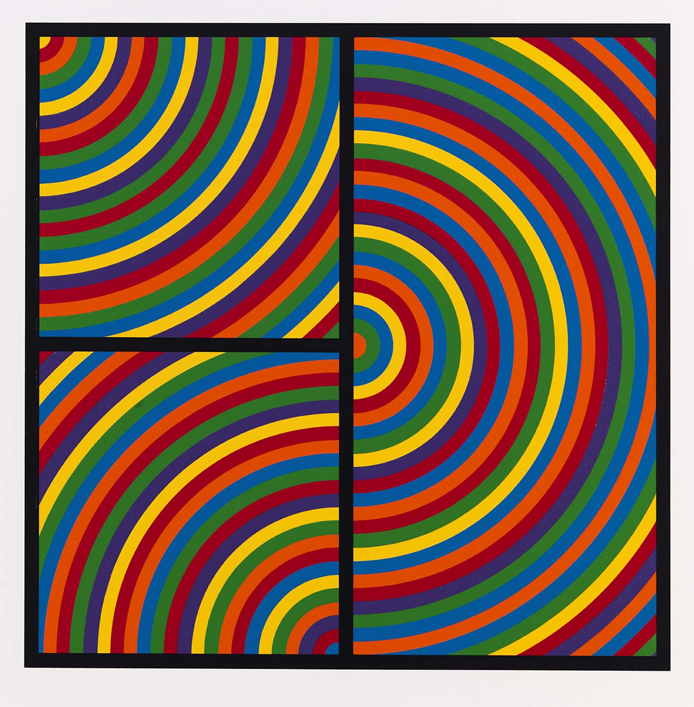
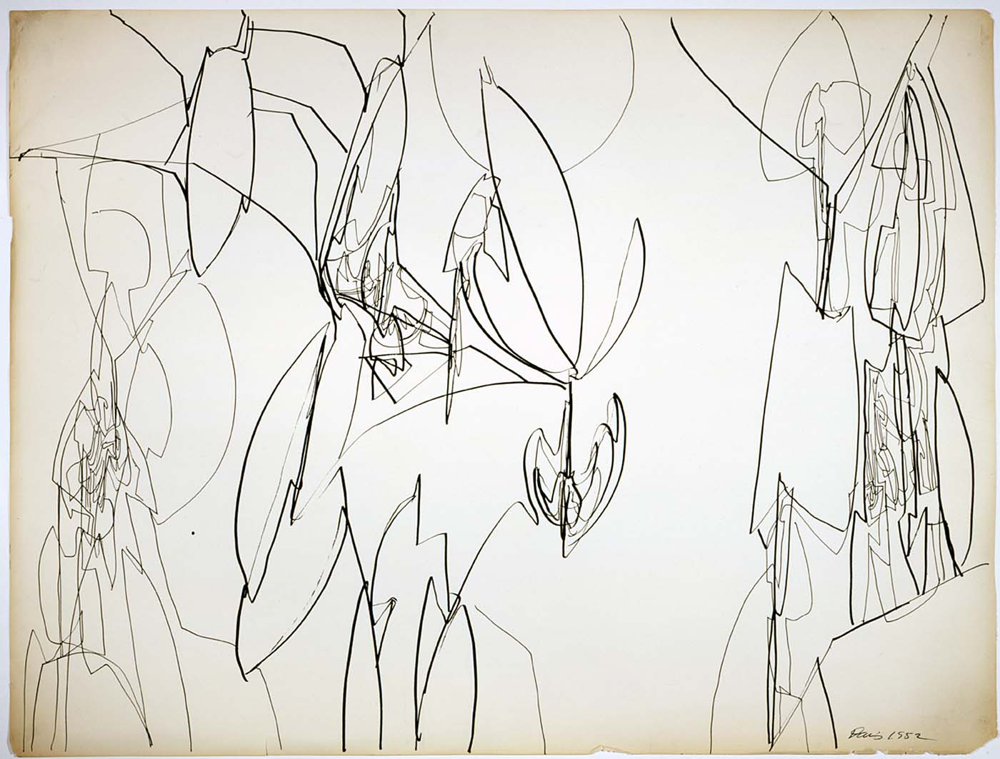

# Gallery Compositions

Context: art museum
Audience: children

Much of the work of a museum educator revolves around mediating the experience of artworks through language. That is, we talk about art, read about art, and write about art. But what if we used *art* to interact with art? What would that look like?

## Goals

These aren't exactly measureable in their current form, but broadly speaking, participants will…

* engage actively with artworks through close looking,
* interact **non-verbally** but still meaningfully with artworks,
* create original music compositions consisting of gestures inspired by artworks.

## Materials

* Three or four different kinds of non-pitched, easy-to-use (and easy-to-abuse) musical instruments. These should be small, cheap items, since you will need one of each per participant. For example:
    * Plastic nose flutes
    * Jingle bells
    * Sandpaper
* Audio recorder

## Activity

### Warm Up and Introduction

Grab everyone's attention by making an intriguing musical gesture with one of the instruments. Then, introduce the gist of the activity: we will be making our own compositions based on the artwork in the gallery.

Introduce the basic techniques of the musical instruments, highlighting the variety of sounds and gestures that they can produce. The goal is not to be exhaustive in this introduction; merely provide the minimum entry point for participants to experiment on their own.

Give everyone two minutes to experiment with an instrument of their choice. Then, give them two more minutes to experiment with one or both of their other instruments.

### Presentation

Ask participants to share some of their favorite sounds that they were able to produce with their instruments. Have the whole group practice making some of the same sounds together.

Now, begin to explore an artwork together.

First, look silently for a couple minutes. This will seem like a long time, but it is not long enough. Ask for a volunteer to make a sound that goes with this artwork. After they have shared their sound, ask them to explain why they chose it. Repeat this with a few participants.

Explain that you want to try an experiment. Let's see what it sounds like when we each make our own noise to go along with this artwork. Some people can make long noises, some people can make short noises. Some people can use the nose flute, some people can use their bell. (And so on...)

Introduce two basic conducting gestures: a downbeat (to start), and a cut-off. 

Cue the group to make their sounds, then cut them off several seconds later.

Ask, "What did you hear?"

### Practice

Work on refining your sound as an ensemble. This will likely happen naturally, but you can also encourage the participants to vary their sounds slightly each time. As a conductor, you can also vary the length of the sounds and introduce other gestures to control the sound as well.

When you feel ready, move on to another artwork and repeat this process of exploration.

## Sample Artworks

Some thought should be given to the artworks that are chosen for this activity. To discourage overtly programmatic music, avoid artworks that contain representations of people or words. Artworks with a strong visual rhythm might encourage participants to create more dynamic compositions, but this should be balanced with artworks that encourage textural exploration.

Here are a couple of examples from the Smithsonian American Art Museum that would provide interesting contrasts:

Color Bands, 2000. Sol LeWitt. 

Sky Machine, 1981. Gene Davis.

